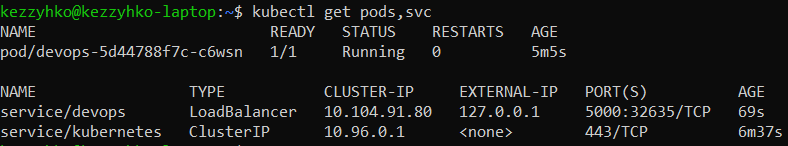
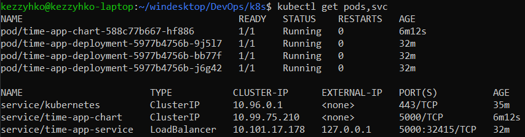
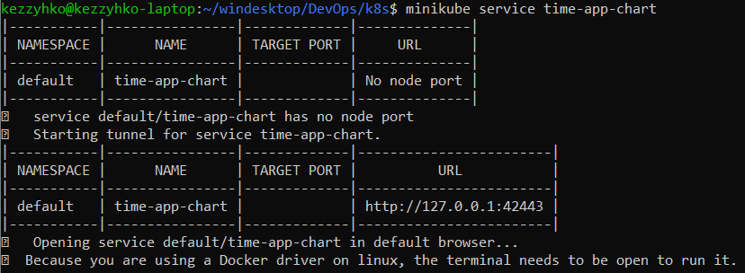
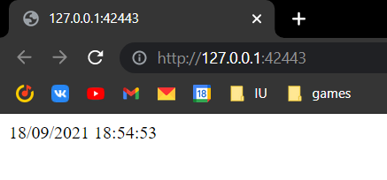
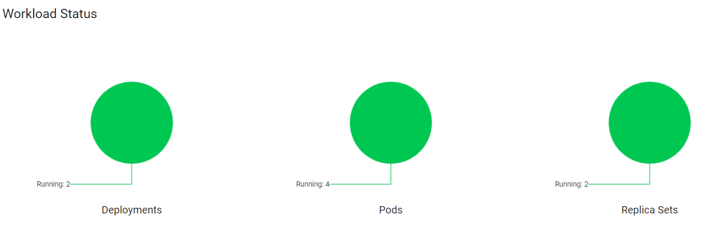
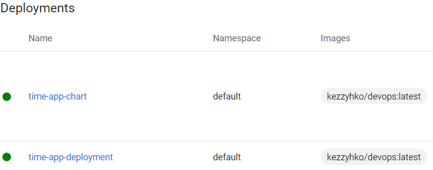
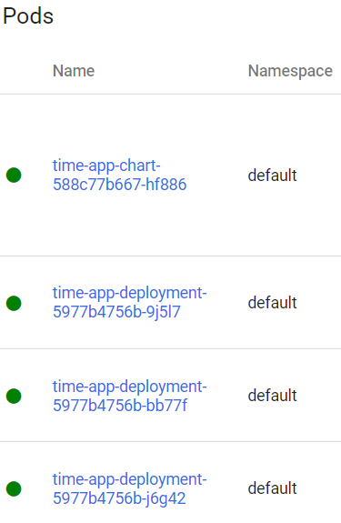
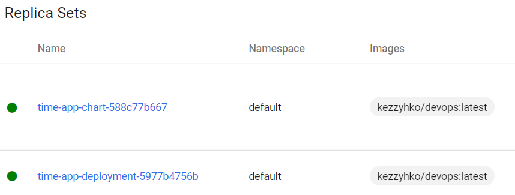

# K8S readme

Table of contents:  
[Outputs of `kubectl get pods,svc`](#outputs-of-kubectl-get)  
[Screenshots of working app](#screenshots-of-working-app)  
[Dashboard screenshots](#dashboard-screenshots)  

## Outputs of `kubectl get`
* with manual command writing

* with the usage of config files

* after adding helm chart

## Screenshots of working app
The service and the app are working:
  
  

## Dashboard screenshots
Also, here are the screenshots of "Workloads" dashboard page  
  
  
  
  
