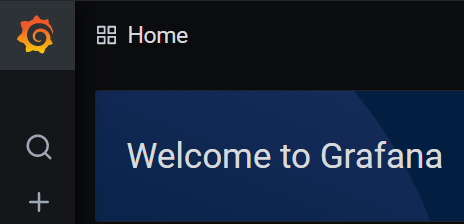
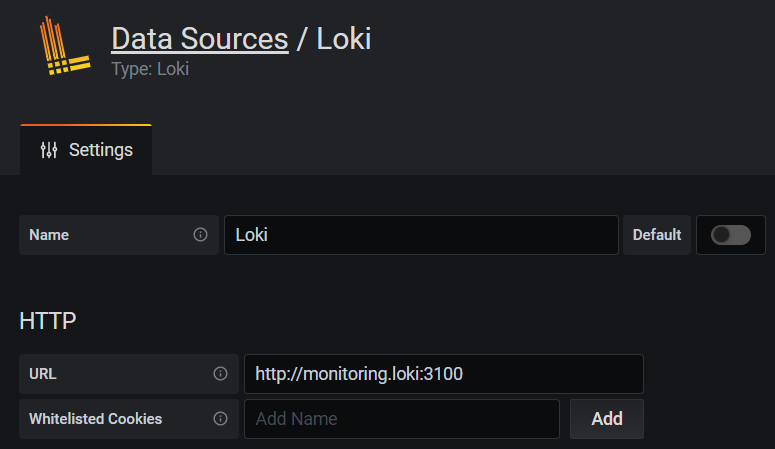
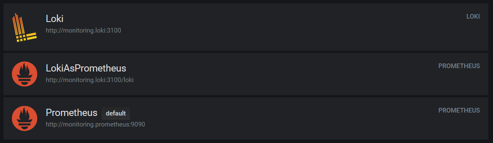

# Monitoring

## Mentions

Thanks to the following repo for example of config files:  
https://github.com/black-rosary/loki-nginx

## Screenshots of working system

Grafana works:  
  
  

All data sources are present:  

 

And everything is working:  

## Best practices

* Dynamic labels should not be used freequently
* Caching should be configured
* Dashboards should be logically separated
* Dashboards should be consistent
* When copying a dashboard, you should not copy tags
