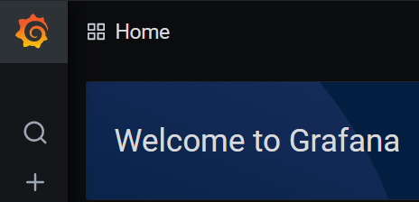
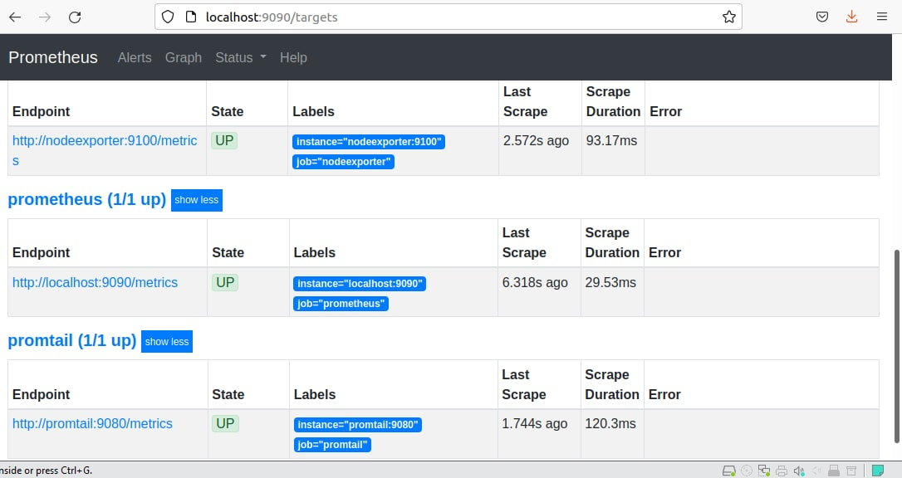
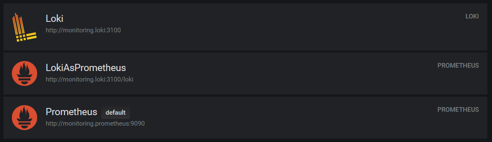
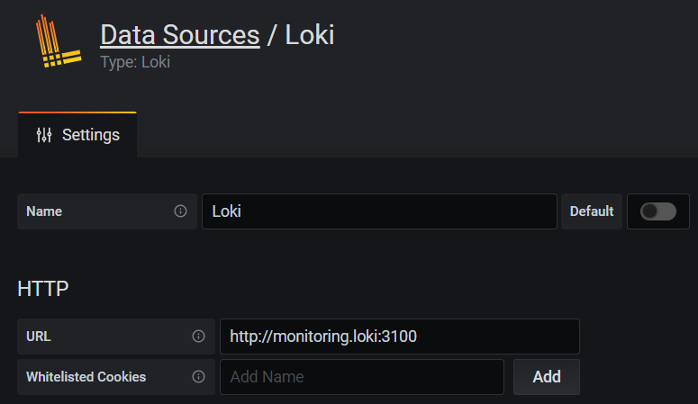
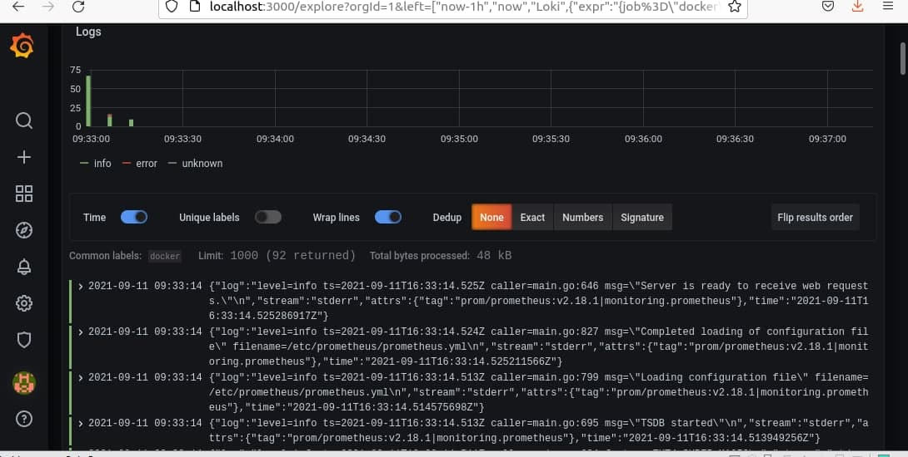
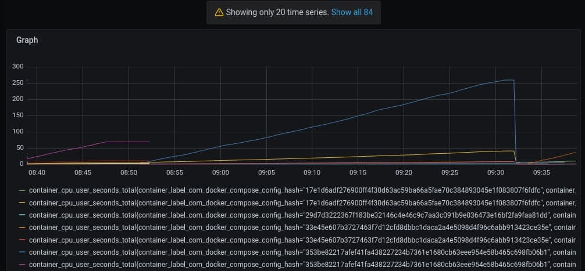
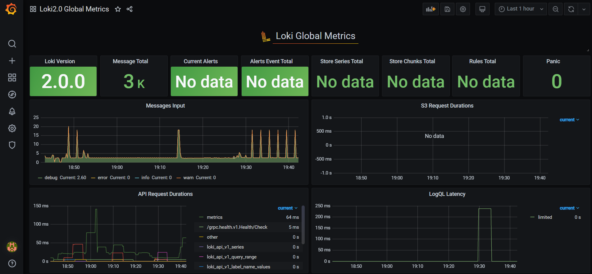
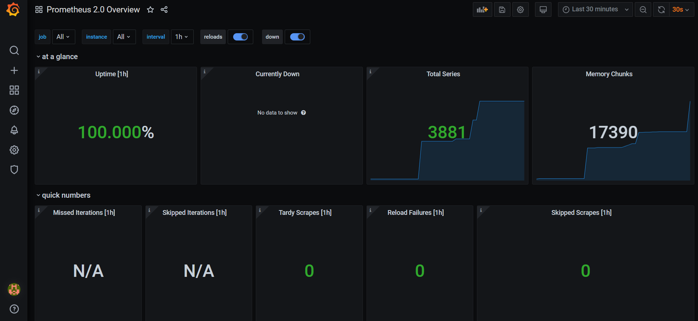

# Monitoring

Table of contents:  
[Disclaimer](#disclaimer)  
[Report and screenshots](#report-and-screenshots)  
[Best practices](#best-practices)  

## Disclaimer

We were provided with example repo in the task: https://github.com/black-rosary/loki-nginx  
Part of config files in this folder was taken form the above mentioned repo.  

## Report and screenshots

Grafana works:  
  
  

Prometheus works:  
  

All data sources are present:  
  
  
  

And they are working:  
  
  

Dashboards are added as well:  
  
  

## Best practices

* Dynamic labels should not be used freequently
* Caching should be configured
* Dashboards should be logically separated
* Dashboards should be consistent
* When copying a dashboard, you should not copy tags
